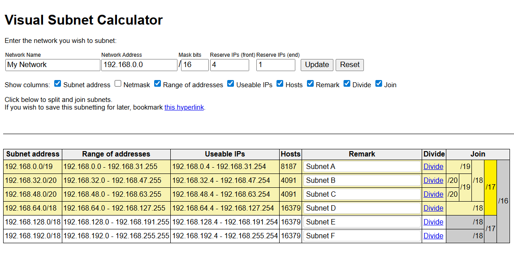

# Visual Subnet Calculator

A web-based interactive subnet calculator for planning and managing IP networks. This tool provides a visual interface for dividing and joining subnets, calculating address ranges, and exporting subnet configurations.

## Features

### Core Functionality
- **Visual Subnet Management** - Split and merge subnets with an intuitive tree-based interface
- **Real-time Calculations** - Instantly see subnet addresses, netmasks, address ranges, and usable IPs
- **CIDR Notation Support** - Work with standard CIDR notation (e.g., `192.168.0.0/16`)
- **Reserve IP Configuration** - Configure reserved IPs at the beginning and end of each subnet

### Interactive Features
- **Hover Highlighting** - Hover over CIDR blocks in the Join column to visually highlight the related subnets that will be merged

### Display Options
Toggle visibility for:
- Subnet address
- Netmask
- Range of addresses
- Useable IPs
- Hosts count
- Remarks/notes
- Divide/Join controls

### Data Persistence
- **Bookmarkable URLs** - Save and share your subnet configurations via URL parameters
- **Network Naming** - Label your network configurations
- **Remarks** - Add notes to individual subnets
- **Column Preferences** - Customize the display and save preferences

## Getting Started

### Usage

1. Open `index.html` in any modern web browser
2. Enter your network address (e.g., `192.168.0.0`)
3. Set the initial mask bits (e.g., `16` for `/16`)
4. Configure reserved IPs if needed (defaults to 1 for network/broadcast addresses)
5. Click **Update** to generate the initial subnet

### Subnet Operations

- **Divide** - Click the "Divide" link to split a subnet into two equal halves
- **Join** - Hover over CIDR blocks in the Join column to highlight related subnets, then click to merge

### Saving Configurations

Once you've configured your subnets:
1. Bookmark the **"this hyperlink"** link shown below the controls
2. The URL contains all subnet divisions, remarks, and display preferences
3. Share the bookmark/URL with colleagues or save for later

## Technical Details

### Technologies
- **HTML5** - Semantic markup
- **CSS3** - Responsive styling with flexbox
- **Vanilla JavaScript** - No dependencies, pure ES6+

### URL Parameters

When saving configurations, the following parameters are encoded in the URL:

| Parameter | Description |
|-----------|-------------|
| `network` | Base network address (e.g., `192.168.0.0`) |
| `mask` | CIDR prefix length (e.g., `16`) |
| `division` | Binary tree encoding of subnet divisions |
| `remarks` | URL-encoded remarks for each subnet |
| `cols` | Hex-encoded column visibility settings |
| `rf` | Reserve IPs at front |
| `re` | Reserve IPs at end |
| `name` | Network name (URL-encoded) |

## Contributing

Contributions are welcome! Please feel free to submit issues or pull requests.

## License

This project is open source. See LICENSE file for details.

## Acknowledgments

Inspired by https://github.com/davidc/subnets
